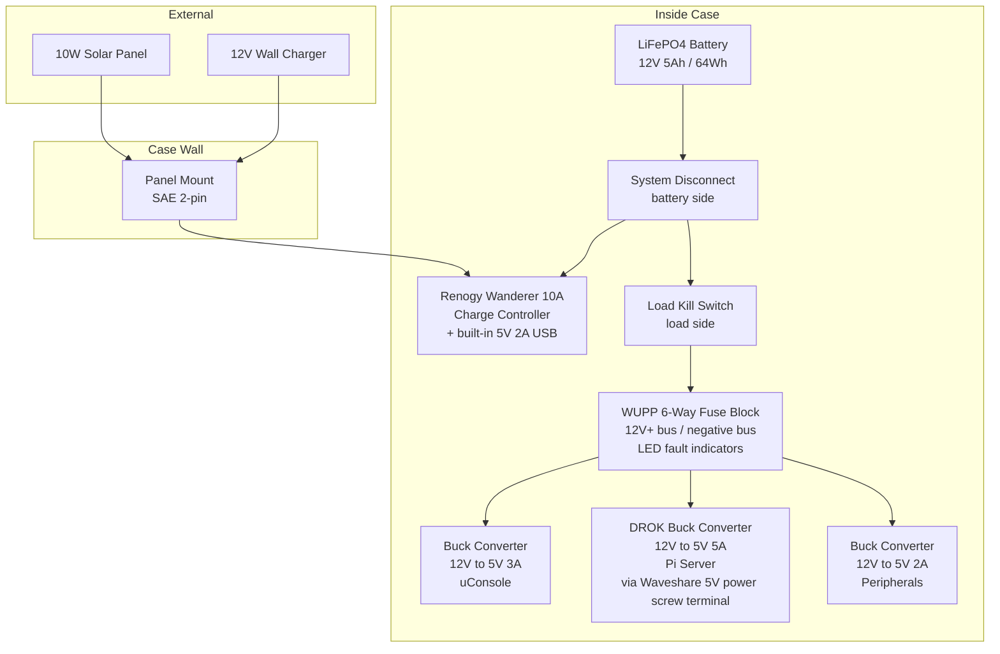
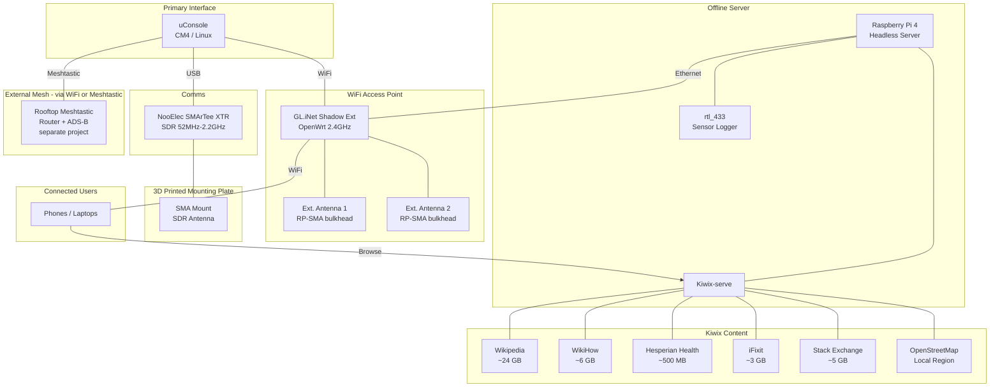
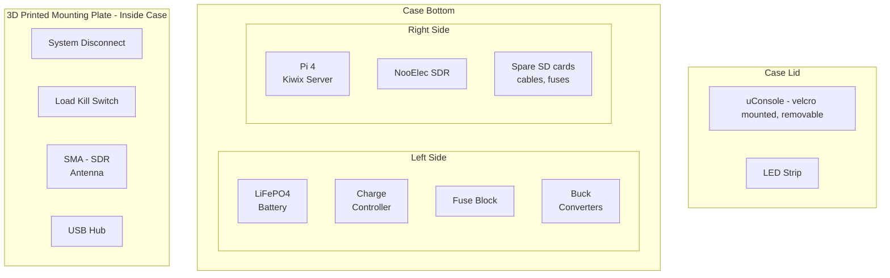
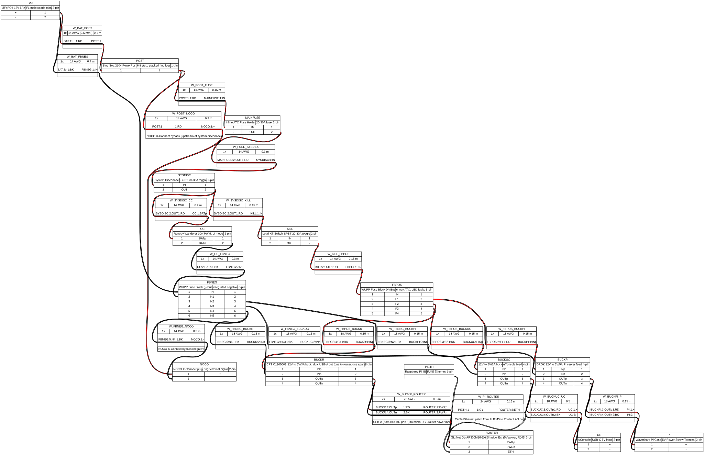
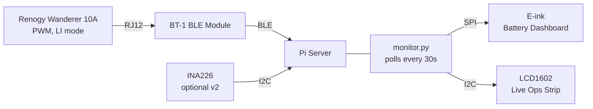

# Doomsday Cyberdeck Build

Portable, self-contained field kit in a hardshell case. uConsole as primary interface, Pi server as offline Kiwix content host, SDR for monitoring, solar-rechargeable LiFePO4 power system.

The complementary always-on Meshtastic + ADS-B rooftop station is a separate project, documented in `rooftop-station.md`. The cyberdeck communicates with that station via Meshtastic when in range.

## Design Goals
- Hardshell case cyberdeck as a portable, self-contained field kit
- uConsole as primary interface (upgradeable with AIO V2 expansion later)
- Pi inside cyberdeck as offline Kiwix content server
- Solar-rechargeable LiFePO4 power system with multiple external power source options
- Repairable, inexpensive, modular

---

## Architecture

### Power System



### Data & Connectivity



### Case Layout



---

## Components — Cyberdeck

### Case
| Part | Notes | Price |
|------|-------|-------|
| Harbor Freight Apache 4800 (recommended) | Pelican 1500 equivalent — same injection-molded PP construction, O-ring seal, pressure equalization valve, lifetime warranty. Build quality is genuinely close to Pelican for ~1/3 the price. Pick-n-pluck foam included. | $50-70 |
| Pelican 1450 or 1500 (alternative) | Marginally better build, higher resale value. Same form factors as Apache 4700/4800. | $80-130 |

The 1500-class interior (~16.75" × 11.18" × 6.12") fits the uConsole, Pi server, battery, SDR, and peripherals with room to spare. The 1450-class (~14.62" × 10.18" × 6.0") is tight but workable.

**On the waterproof tradeoff:** both cases ship IP67 (submersible) when sealed. The moment you drill for the SAE 2-pin panel mount and the two RP-SMA antenna bulkheads, that rating drops to ~IP65 (splash-resistant) even with gasketed mounts. Since the operating mode is *case open for SDR work* (the WiFi antennas are external), the IP67 spec only protects the kit during transport/storage. That makes the Pelican's premium hard to justify for this build — the Apache delivers the same practical protection at a fraction of the cost. The case's built-in Gore-Tex pressure equalization valve handles altitude/temperature changes during transport and is all the ventilation the sealed-travel mode needs.

### Primary Interface — Clockwork Pi uConsole
| Part | Notes | Price |
|------|-------|-------|
| uConsole (already ordered) | CM4 or A06 core, built-in screen + keyboard | $150-200 |
| Extra CM4 module | Spare in case of failure | $35-45 |
| USB-C PD trigger board (5V) | Powers uConsole from 12V battery bus via buck converter | $3 |

The uConsole lives in the case lid or top layer. Open the case and it's ready to go. Can also be removed and used standalone.

**Future upgrade:** HackerGadgets AIO V2 expansion card (~$92-145) adds built-in RTL-SDR, LoRa/Meshtastic, GPS, RTC, USB hub, and Ethernet to the uConsole in a single module. When installed, the NooElec SDR can be retired from the cyberdeck or moved to another project.

### Offline Content Server
| Part | Notes | Price |
|------|-------|-------|
| Raspberry Pi 4B (4GB) | Serves Kiwix content over the GL.iNet router's WiFi network. Connected to the router via Ethernet (cleaner backhaul than WiFi). Low power draw (~4W). | $45-55 |
| 256GB NVMe SSD (M.2 2280/2242) | Connects directly via the Waveshare case NVMe slot. Faster and more reliable than microSD. | $25-40 |
| GL.iNet GL-AR300M16-Ext "Shadow Ext" travel router | Dedicated WiFi access point + DHCP/DNS server, OpenWrt out of the box. 2.4GHz only (sufficient for Kiwix traffic), 2× external RP-SMA antennas (planned for external case-wall mounting), 128 MB RAM, dual Ethernet (WAN + LAN), 5V powered. Replaces the Pi's hostapd/dnsmasq AP duties — Pi connects to the router's LAN port via short Ethernet patch and just runs Kiwix. | $39 |
| RP-SMA bulkhead extension pigtails (×2) | RG316 or RG174 cable, ~6" long, RP-SMA male on the router end and RP-SMA female bulkhead with mounting nut + rubber gasket on the case end. Routes the router's antennas through the case wall so they mount externally. Use the stock antennas that ship with the Shadow Ext, or upgrade to higher-gain whips later. | $8-12 (pair) |
| Short Ethernet patch cable (~6-12") | Pi Ethernet port → Shadow Ext LAN port. Cat5e or Cat6, doesn't matter at our throughput. | $3-5 |
| Waveshare Pi box case (NVMe variant) | Reroutes USB-C / HDMI / Ethernet to the rear, integrates NVMe slot alongside the Pi (no traditional HAT stack), active cooling fan, and exposes a **5V power screw terminal** on the rear panel as an alternative power input (bypasses USB-C PD negotiation). | $25-35 |

### SDR
| Part | Notes | Price |
|------|-------|-------|
| NooElec SMArTee XTR (already owned) | E4000 tuner, 52 MHz - 2.2 GHz | — |
| Telescoping whip antenna (SMA) | Screws directly into SDR on mounting plate | $8-12 |

### 3D Printed Mounting Plate
| Part | Notes | Price |
|------|-------|-------|
| Mounting plate (3D printed) | Internal plate that holds the SDR and USB hub in a fixed position. Antennas screw directly into devices. Sits in the case bottom, secured with velcro or foam friction fit. | ~$2 filament |
| Short USB-A pigtail / hub | Connects mounted devices to the Pi or uConsole | $5-8 |

The case runs open when antennas are deployed. When traveling or storing, unscrew antennas, stow them in foam cutouts, and close the case — everything stays sealed and protected.

### Power System
| Part | Notes | Price |
|------|-------|-------|
| LiFePO4 12V 5Ah / 64Wh battery (on hand) | Safe chemistry (no thermal runaway), 2000+ cycle life, flat discharge curve. Using a spare 5Ah pack already on the shelf instead of buying a 6Ah. SLA-style form factor with F1 (or F2 — verify) male spade tabs on top. | $0 (spare) |
| Battery termination kit | Female fully-insulated quick-disconnect terminals matching the battery's tab size (F1 = 0.187" / 4.75mm, F2 = 0.250" / 6.35mm) — measure the actual tab before ordering, or buy an assortment pack with both sizes. 14 AWG marine-grade tinned-copper wire pigtails (~6") from each terminal to ring lugs (#10 stud) that bolt onto the system disconnect. Keep heat-shrink over each crimp. A proper ratcheting crimper (Klein, IWISS, or Engineer brand, ~$25) makes durable joints; plier-style crimpers fail under vibration. | $10-30 (terminals + lugs + crimper if not on hand) |
| NOCO X-Connect ring-terminal pigtail (permanent install for smart charging) | The NOCO Genius ships with both alligator clamps and X-Connect ring-terminal leads. The ring-terminal lead is a short cable ending in two ring lugs (positive and negative) on one end and the NOCO X-Connect plug on the other. Stack the ring lugs onto the battery distribution post (positive lead) and fuse block (−) bus (negative lead), so the NOCO X-Connect plug dangles inside the case ready to receive the NOCO's main cable. Bypasses both the system disconnect and the load kill switch — direct battery access — so the NOCO can charge the pack regardless of switch state. | $0 (ships with NOCO Genius) |
| Blue Sea 2104 PowerPost Plus (battery distribution post, positive side) | Single threaded stud (5/16" / M8) with insulated base and clear protective cap. Acts as the central stacking point for the positive lead before the system disconnect — battery (+) wire, wire to system disconnect input, NOCO X-Connect (+) lead, and one spare for future expansion all stack here. Rated 600A (massively above our ~10A use), but the value is the form factor and the cap that prevents accidental shorts during install. Generic Amazon equivalents work fine at ~$5-8 if budget matters more than brand. | $10-15 |
| Renogy Wanderer 10A charge controller | PWM, 12V, negative ground. Selectable battery profiles include LI (LiFePO4: 14.4V boost / 13.6V float / 10.8V LVD) — must be set via LCD menu after install (default is SLD lead-acid). 10A is plenty for the 50W panel and a future 100W upgrade; 100W+ panels are earmarked for the separate solar generator project anyway. RS232 / RJ12 port accepts Renogy BT-1 Bluetooth module for telemetry (officially compatible per Renogy's product page). Built-in 5V/2A dual USB output on the front (see Power System). Lives inside the case. | $20 |
| 12V buck converter to 5V 3A (uConsole) | USB-C output module, clean power for uConsole. | $5-8 |
| 12V buck converter to 5V 5A (Pi server) — **DROK 12V→5V/5A** recommended | Feeds the Waveshare case's rear 5V power screw terminal directly — bypasses USB-C PD negotiation and avoids undervoltage under NVMe + fan load. The DROK module (~$10) is a solid choice: synchronous rectification (~93-95% efficient), reverse-polarity protection, both screw-terminal and USB-A outputs at 5V/5A. Use the **screw-terminal output** to feed the Waveshare case (cleaner than USB-A → adapter). Set output to ~5.1–5.15V (measured no-load) to compensate for wire drop; verify at the Pi under load. Use 18 AWG minimum on the short 5V run from buck to case. | $10-20 |
| 12V buck converter to 5V 2A (x1) | For peripherals. **Optional — can be dropped** if you use the Wanderer 10A's built-in 5V 2A USB output instead. The controller's USB is fed through its own internal regulator off the 12V battery bus, so it's electrically equivalent to a dedicated buck. Saves $5 and a mounting position. | $0-5 |
| WUPP 6-way ATC fuse block with integrated negative bus + LED fault indicators (on hand) | 6 fused positive circuits and a built-in negative bus in one unit — eliminates the need for a separate ground bar. Per-circuit red LEDs light when a fuse blows (huge debugging win). Clear cover, ~30A bus rating, 12-24V DC. Only 2-3 circuits will be used; the rest are spares for future expansion (direct-12V SDR, antenna preamp, second Pi, etc.). Suggested fuse sizes: 5A for the Pi-server buck, 5A for the uConsole buck, 3A for the optional peripherals buck. | $15-20 (or $0 if on hand) |
| 10W folding solar panel | For field charging. Plugs into panel-mount SAE on case wall. | $20-30 |
| SAE 2-pin connectors and pigtails | Industry-standard 12V DC connector used by NOCO, CTEK, Battery Tender, Optimate, motorcycle/RV trickle chargers, and most consumer solar adapters. Cheap, abundant pre-made cables, MC4-to-SAE adapters readily available for the solar panel. **Polarity is convention, not enforced** — standard is positive on the female pin (covered by the plastic shell), which matches NOCO / Battery Tender / CTEK. Verify any new adapter with a multimeter on first use; mark verified cables with a colored shrink-wrap ring. | $5-10 (small kit of pairs and pigtails) |
| SAE 2-pin panel mount with weather cap | DC input on the case wall, gasketed for splash resistance. One of three case-wall holes (the other two are RP-SMA antenna bulkheads). | $5-10 |
| System disconnect + load kill switch (matching pair) | Two identical panel-mount toggle switches rated 20-30A. **System disconnect** sits on the battery's positive lead before the charge controller — flipping it off fully isolates the controller and load bus from the battery, eliminating the controller's ~10mA parasitic draw during long-term storage. (The NOCO X-Connect taps upstream of this switch so smart charging still works regardless.) **Load kill switch** sits downstream of the system disconnect, cutting only the fuse block / loads while leaving the controller energized so solar can passively maintain the battery. Same model for a clean look on the mounting plate; differentiate with engraved labels ("SYSTEM" / "LOAD") plus colored shrink-wrap rings (e.g., red for system, black for load) to prevent muscle-memory mistakes. | $10-20 (pair) |
| 12V 5A regulated wall brick (Mean Well GST60A12 or equivalent) | Primary wall charging. 5A is enough to run loads and charge the battery simultaneously; the old 2A spec could only run loads. Terminates in SAE 2-pin via a barrel-to-SAE pigtail. | $25-30 |
| Cig lighter plug → SAE cable | Charge from a vehicle, a solar generator (Jackery / EcoFlow / Bluetti 12V output), or a propane/inverter generator's 12V accessory port. | $8-12 |
| SAE ↔ SAE cable (~3 ft) | Parallel an external 12V LiFePO4 pack into the case input for extended runtime or emergency top-up. Slow trickle as voltages equalize — fine for topup, not fast charge. | $8-12 |

**Power flow:** See the Power System diagram in the Architecture section above.

**External Power Sources — single-input-handles-everything:**

The SAE 2-pin panel mount on the case wall is the *only* power input, regardless of source. Anything 12-22V DC plugs in and the Renogy Wanderer handles the rest — it doesn't distinguish between a solar panel, a wall brick, or another battery; it just sees DC above the battery and charges accordingly.

| Source | How it connects | Notes |
|--------|-----------------|-------|
| 50W folding solar panel | Panel cable → SAE | Primary field charging. |
| Wall plug (home / generator AC) | Mean Well 12V 5A brick → barrel-to-SAE pigtail | Run loads + charge simultaneously. Works off any 120V AC outlet, including a propane/inverter generator. |
| Vehicle 12V / cig lighter | Cig lighter plug → SAE cable | Car running: 13-14V. Ignition off: ~12.5V. Either charges fine. |
| Solar generator (Jackery / EcoFlow / Bluetti) | Unit's 12V output (cig or barrel) → SAE | Most portable power stations expose a regulated 12V output spec'd for CPAPs / routers. Clean and steady. |
| External 12V LiFePO4 pack | SAE ↔ SAE cable | Parallels the second pack into the input. Slow trickle as voltages equalize — good for extended runtime or emergency top-up, not fast charge. |
| USB-C PD power bank (100W+) | PD → 12V trigger cable → SAE | Caps around 36W (12V/3A). Trickle-charge only. Niche but useful if all you have is a laptop power bank. |

**Voltage ceiling:** the Wanderer accepts up to ~25V on the solar input on a 12V system. All the sources above are well under that. The 100W panels (Voc ~22-25V) are earmarked for a separate MPPT solar-generator project and should *not* be plugged into this SAE input.

**Source routing — which sources go through the controller vs. direct to battery:**

| Source type | Connection point |
|-------------|-----------------|
| Solar panel | SAE case input → Wanderer solar input |
| 12V wall brick (Mean Well etc.) | SAE case input → Wanderer solar input |
| Vehicle 12V / cig lighter | SAE case input → Wanderer solar input |
| Solar generator 12V output | SAE case input → Wanderer solar input |
| External 12V LiFePO4 pack (parallel) | SAE case input → Wanderer solar input |
| **NOCO Genius or other smart LiFePO4 charger (14.6V CC/CV)** | **Direct to battery terminals — do NOT feed the Wanderer's solar input** |

Rule of thumb: **dumb DC sources** (panels, wall bricks, batteries) go through the charge controller, which handles regulation. **Smart chargers** that run their own multi-stage algorithm (NOCO Genius, dedicated LiFePO4 bench chargers) go direct to the battery terminals — feeding a smart charger into a PWM solar input can trigger its no-battery-detected fault or cause the two algorithms to fight each other.

**NOCO connection — direct to battery, not the fuse panel:**

The NOCO X-Connect ring-terminal pigtail bolts onto the same battery-side studs as the main system pigtails, *upstream* of both the system disconnect and the load kill switch. This bypass matters because:

| Connection point | NOCO can charge when... | Verdict |
|------------------|-----------------------|---------|
| **Direct to battery terminals (recommended)** | Always — regardless of switch states | Lowest resistance, works in any mode, allows isolated-battery charging with system disconnect OFF |
| Fuse panel positive bus | Only when system disconnect AND load kill are both ON | Forces both switches on; charge current passes through the load kill switch (sized for loads, not as a charge path); no isolated-charge mode |

Practically: with the X-Connect pigtail permanently installed, the X-Connect plug dangles inside the case or on the mounting plate. To charge, snap the NOCO's main cable into it. To stop, unsnap. Battery terminals are never touched once the kit is built.

A common operating pattern: flip system disconnect OFF, plug NOCO in, charge to full while the rest of the system is fully isolated and the controller's parasitic draw is zero. Then unplug NOCO, flip system disconnect back ON, kit is ready to deploy.

**Charge controller heat:** the Wanderer 10A is rated for 10A operation. The 50W panel delivers ~3-4A peak — about 30-40% of rating. At that load the controller dissipates a couple of watts and runs warm but not hot. Built-in overheat derating (kicks in ~45-50°C case temp) is never approached in normal use; if the case sits in direct sun closed, that could change — keep operations lid-open per the case-state table.

**What goes on the fuse block — and what doesn't:**

Only devices that draw power directly from the 12V bus need a fused circuit. Anything downstream of a buck (i.e., on a 5V rail) is already protected by the buck's current limit + the buck's upstream fuse. Anything powered by the charge controller (BT-1 over RJ12, controller's built-in USB output) is on the controller's side of the bus and not routed through the fuse block at all.

| Device | Power source | Needs fused circuit? |
|--------|-------------|----------------------|
| Buck #1 → uConsole | 12V bus | **Yes — 5A fuse** |
| Buck #2 → Pi server (Waveshare 12V terminals) | 12V bus | **Yes — 5A fuse** |
| Buck #3 → peripherals (optional) | 12V bus | **3A fuse** if used; can be skipped in favor of the controller's 5V/2A USB output |
| E-ink display | Pi GPIO 5V | No — Pi's circuit covers it |
| LCD1602 | Pi GPIO 5V | No — Pi's circuit covers it |
| INA226 sensor (optional v2) | Pi GPIO 3.3V via I²C | No — Pi's circuit covers it; the shunt sits inline on the 12V bus separately |
| BT-1 Bluetooth module | Charge controller via RJ12 | No — controller-side power, never touches the fuse block |

Realistic fuse-block usage is **2-3 of the 6 circuits**, leaving 3-4 spares for future expansion (direct-12V SDR power rail, antenna preamp/LNA, additional always-on sensor, second Pi if integrating the rooftop station).

**System disconnect vs. load kill switch — switch state matrix:**

The two switches form a layered isolation system. Both are on the battery's positive lead, daisy-chained: system disconnect is first, load kill branches off downstream of it. (Note: the NOCO X-Connect bypass taps upstream of both switches, so smart charging is independent of these states.)

| System Disconnect | Load Kill | Result |
|-------------------|-----------|--------|
| OFF | (any) | Full isolation — long-term storage mode, zero parasitic draw from controller. NOCO can still charge the battery via X-Connect. |
| ON | OFF | Passive solar maintenance — controller charges from sun, loads off |
| ON | ON | Normal operation |
| OFF | ON | Pointless state — no power source reaches the loads (system disconnect cut everything downstream) |

**Parasitic draw — why the system disconnect matters:**

The Renogy Wanderer Li draws ~10mA continuously from the battery for its own operation (display, microcontroller, BLE module if BT-1 is attached). That's ~0.12W or ~2.9Wh/day — roughly **4.5% of the 64Wh pack per day** with no sun and no loads. After ~20 days of indoor storage with no solar input, the pack would be drained by the controller alone. For comparison, the LiFePO4 cell's own self-discharge is ~2-3% per *month*, so the controller is by far the dominant idle drain.

**Storage rules of thumb:**
- **Daily / weekly use:** ignore parasitic draw — the kit cycles before it matters.
- **Stored 2-4 weeks indoors:** flip system disconnect OFF if convenient, otherwise top up before next deployment.
- **Stored 1-3+ months indoors with no sun:** system disconnect OFF is mandatory to avoid deep discharge.
- **Stored outdoors with any sun on the panel:** system disconnect ON is fine; even cloudy ambient light offsets 10mA.

**For extended off-grid usage** beyond what the 50W panel + 64Wh battery can sustain, reach for one of the external sources above. Daily/heavy Kiwix + Kolibri use lives on the home server; the cyberdeck is a portable kit, not an always-on platform.

**Pi server feed — why the rear power screw terminal, not USB-C:** Early bench testing with a 3A USB-C supply produced undervoltage warnings under load once the NVMe adapter and active cooling fan were added to the Waveshare case. The case's rear 5V power screw terminal is fed from a dedicated DROK 12V→5V/5A buck on the 12V battery bus, bypassing USB-C PD negotiation entirely. This also gives the Pi UPS-style ride-through on solar dips. If running a Pi 5, set `usb_max_current_enable=1` in `/boot/firmware/config.txt` so the Pi doesn't cap USB ports at 600mA in the absence of PD negotiation.

**Wiring topology — battery distribution post is the central stacking point:**

The Blue Sea 2104 PowerPost (or equivalent) is bolted to the 3D printed plate near the battery. A single short pigtail runs from the battery (+) tab to the post; everything else stacks on the post via ring lugs. This keeps battery-side wiring tidy, eliminates congestion at the system disconnect's terminals, and makes future expansion (additional sources, second battery in parallel, etc.) trivial.

**Full + / − wiring diagram:**

The harness diagram is generated from `cyberdeck-wiring.yml` using [WireViz](https://github.com/wireviz/WireViz) — a YAML-driven wire-harness documentation tool that produces proper schematic-style output (color-coded wires, gauge labels, terminations) plus an auto-generated bill of materials.



**Regenerating the diagram:**

The YAML source is the source of truth. Whenever wiring changes, edit `cyberdeck-wiring.yml` and re-run the build script:

```bash
./build-wiring-diagram.sh
```

This regenerates `cyberdeck-wiring.svg` (embedded above), `cyberdeck-wiring.png`, `cyberdeck-wiring.html` (interactive), and `cyberdeck-wiring.bom.tsv` (bill of materials). Commit the regenerated SVG alongside the YAML so GitHub renders it inline without requiring readers to install WireViz.

First-time setup:

```bash
pip install --user wireviz       # or: pipx install wireviz
sudo apt install graphviz        # WireViz needs the `dot` binary
```

**Reading the diagram:** positive (+) lead flows from battery → PowerPost (where it branches to the NOCO X-Connect bypass and the main path) → main fuse → system disconnect → splits to charge controller and load kill switch → fuse block → bucks. Negative (−) lead flows from battery → fuse block (−) bus, where the charge controller's BAT−, the NOCO's X-Connect (−), and all load returns also land. Negative bypasses both switches; only positive is interrupted.

```
Battery (+) tab
  ↓ F1 female spade
  ↓ 14 AWG red wire (~3-4")
  ↓ ring lug (5/16" stud)
  ↓
[ POSITIVE DISTRIBUTION POST ]   ← stacked ring lugs:
  ├── Battery (+) feed (incoming)
  ├── Wire to System Disconnect input (outgoing main path)
  ├── NOCO X-Connect (+) lead (bypass charging)
  └── Spare for future expansion

System Disconnect input
  ↓ (switch closed)
System Disconnect output
  ↓ split: Charge Controller BAT+ and Load Kill Switch input

Battery (−) tab
  ↓ F1 female spade
  ↓ 14 AWG black wire
  ↓ ring lug
  ↓
[ FUSE BLOCK (−) BUS ]   ← stacked ring lugs:
  ├── Battery (−) feed (incoming)
  ├── Charge Controller BAT− (return)
  ├── NOCO X-Connect (−) lead
  └── Common return for all loads
```

The negative side reuses the fuse block's integrated negative bus rather than a dedicated post — less hardware, same electrical result. If symmetry matters, add a second PowerPost for the negative side instead of using the fuse block bus (purely stylistic — adds ~$12 and one mounting position).

**Wiring path for the Pi server feed:**

```
Fuse block (5A fused 12V output)
  ↓ 14 AWG red+black
DROK Input + / Input −
  ↓
DROK Output + / Output −  (5V, trimmed to ~5.1-5.15V no-load)
  ↓ 18 AWG red+black, short run (~6")
Waveshare rear "Power screw terminal" (5V input)
  ↓ (case's internal traces)
Pi 5V rail
```

**Runtime estimates (12V 5Ah = 64Wh nominal, ~51Wh delivered after ~90% usable DoD and ~88% buck efficiency):**
| Load | Draw | Runtime |
|------|------|---------|
| Pi server idle, serving Kiwix on WiFi AP | ~4-5W | ~10-12 hours |
| Pi server + uConsole active | ~9-10W | ~5-6 hours |
| Everything running (Pi + uConsole + SDR + NVMe + fan) | ~12-14W | ~3.5-4 hours |
| Everything + solar panel in sun | net ~3-7W | Extended / indefinite in good sun |

Numbers assume Pi 5 with NVMe + active cooling fan. For Pi 4, add ~25-30% to each runtime (lower idle and peak draw). Benchmark under real workload to confirm.

### Monitoring & Telemetry

Two displays, each playing a different role. The e-ink gives a slow, low-power battery dashboard; the character LCD gives a fast, glanceable live status strip.

| Part | Notes | Price |
|------|-------|-------|
| Waveshare e-ink display (on hand) | Battery dashboard: SoC %, voltage, net current, estimated runtime, solar input, last-update timestamp. Zero idle power between refreshes — ideal for a runtime-constrained build. Refresh every 30-60s. Mounted on the 3D printed plate or case lid. | $0 (on hand) |
| SunFounder PCF8574 I²C LCD1602 (on hand) | Live ops strip: Kiwix AP status + client count, Meshtastic peer count, 12V bus voltage. Refresh every 1-2s. Backlight useful at night when glancing at the case. Mounted near the kill switch on the 3D printed plate. | $0 (on hand) |
| Renogy BT-1 Bluetooth module | Primary telemetry path. Plugs into the Wanderer 10A's RS232 (RJ12) port — officially compatible per Renogy's product page. Pi reads voltage / charge current / load current / SoC / daily Ah over BLE using the `cyrils/renogy-bt` Python library. ~82 ft signal range, 16.4 ft cable. | $18-22 |
| INA226 I²C current sensor (optional v2 accuracy upgrade) | Coulomb-counting on the main 12V bus for tighter SoC accuracy than the controller's internal estimate. LiFePO4 has a flat voltage curve mid-pack, so voltage-only SoC is imprecise; integrating current over time is the fix. Skip for v1; add later if the Renogy's internal SoC drifts noticeably across charge cycles. | $5-8 |

**Telemetry architecture:**



**What each display shows:**

E-ink (slow, pretty, zero-idle-power):
- Large SoC % with bar graph
- Battery voltage + net current (charge/discharge indicator)
- Estimated runtime at current draw
- Solar input watts
- 24-hour sparkline (optional)
- Last update timestamp

LCD1602 (fast, utilitarian, 2×16 chars):
```
KIWIX:UP  CLI:2
MESH:3p   14.2V
```
Line 1: Kiwix server status + AP client count. Line 2: mesh peer count + bus voltage. Refreshes every 1-2s.

**Runtime estimation:** For v1, trust the Renogy's internal SoC reading. `runtime_hours = (SoC% × 64Wh × 0.88) / current_load_W`. If accuracy drifts (LiFePO4's flat voltage curve makes voltage-only SoC unreliable mid-pack), add the INA226 and integrate current over time for a true coulomb count.

**GPIO pinout reference (deliberately not in the WireViz harness):**

The displays and optional INA226 sensor connect to the Pi's 40-pin header for both power and data. They draw from the Pi's internal 5V/3.3V rails (which trace back to the DROK buck via the Waveshare case's 5V terminal), so they don't touch the 12V harness or the fuse block.

| Device | Bus | Pi pins | Notes |
|--------|-----|---------|-------|
| LCD1602 with PCF8574 backpack | I²C | 2 (5V), 6 (GND), 3 (SDA), 5 (SCL) | 4 jumper wires; default I²C address 0x27 (or 0x3F on some clones) |
| Waveshare e-ink (HAT variant) | SPI + control GPIO | Stacks on full 40-pin header | No wiring required if you use the HAT version; for a discrete e-ink module use SPI MOSI/SCLK/CE0 + DC/RST/BUSY GPIOs per Waveshare's wiring guide |
| INA226 (optional v2) | I²C | 1 (3.3V), 9 (GND), 3 (SDA), 5 (SCL) | Shares the I²C bus with LCD1602; default address 0x40. The high-current shunt resistor sits inline on the 12V positive bus, separately. |

The Waveshare Pi case's "Pi5 Connector Adapter" PCB intermediates the GPIO header; verify which pins are passed through vs. consumed by the case's own functions (active fan power, NVMe adapter signaling) before final assembly. If the case occupies pins the displays need, route via female-to-female jumpers from the case's exposed GPIO breakout rather than stacking a HAT.

### Internal Wiring & Layout
| Part | Notes | Price |
|------|-------|-------|
| 14 AWG marine-grade tinned copper wire (red + black, ~25 ft each) | Main current paths: battery feeds, switches, fuse block, NOCO X-Connect bypass leads. Tinned copper resists strand corrosion in long-term storage; marine-grade construction handles vibration during transport. Brands: Ancor, Pacer, Cobra Wire & Cable. **Do not substitute CCA (copper-clad aluminum)** — higher resistance, fragile under flex, galvanic corrosion at copper-terminal interfaces. | $25-40 |
| 18 AWG marine-grade tinned copper wire (red + black, on hand) | Branch wires: buck inputs (1-3A) and 5V outputs to Pi/uConsole (2-5A short runs). Same marine-grade requirement as the 14 AWG. | $0 (on hand) |
| Kaizen foam (2 layers) | Custom-cut inserts. Way better than pick-n-pluck for a clean layout. | $15-20 |
| Velcro strips + zip ties | For securing components that need to be removable | $5 |
| USB-A/C ports on mounting plate or short extension cables | For charging phones, connecting peripherals with case open | $5-8 |
| 12V LED strip (small, warm white) | Optional: light inside the case lid for night use | $3 |
| Short USB-C cables (6-12") | Internal connections, avoid cable spaghetti | $8-10 |

---

## Software Stack — Cyberdeck Pi

### Base OS
- **Raspberry Pi OS Lite (64-bit)** — no desktop needed, headless server

### WiFi Access Point
- **GL.iNet Shadow Ext (OpenWrt)** handles AP, DHCP, DNS — not the Pi.
- SSID something like "EMERGENCY-INFO" or "COMMUNITY-NET"
- Captive portal (OpenWrt's built-in or `nodogsplash`) redirects clients to the Kiwix landing page on the Pi
- Pi gets a static LAN IP from the router; clients access Kiwix at `http://<pi-static-ip>:8080` (or via captive portal redirect)
- Router's WAN port can be plugged into home network when at home — gives the Pi internet access for `apt update` without changing the field config

### Offline Content — Kiwix ZIM Files

Focused on practical survival, repair, and reference content:

| Content | Size | Why |
|---------|------|-----|
| Wikipedia (English, no pictures) | ~24 GB | Covers everything — first aid, plant ID, mechanical repair, chemistry, etc. |
| WikiHow | ~6 GB | Step-by-step guides for repairs, gardening, cooking, survival skills |
| Hesperian Health Guides | ~500 MB | Practical first aid and medical reference for resource-limited settings |
| iFixit | ~3 GB | Repair guides for electronics, appliances, vehicles |
| Stack Exchange (Gardening, Home Improvement, DIY) | ~5 GB | Q&A for gardening, repairs, electrical work |
| Wikivoyage | ~700 MB | Travel/survival info, regional knowledge |
| OpenStreetMap (local region) | Varies | Offline maps for your area |
| Practical Engineering / Appropriate Technology | ~200 MB | Low-tech solutions, water purification, sanitation |

**Total: ~40 GB** — fits easily on a 256GB card with plenty of room for future content.

Kiwix full-text search is fast on a Pi 4 — results return in under a second. No AI needed for finding first aid procedures, gardening guides, or repair instructions.

### Key Software
- **Kiwix-serve** — serves all ZIM content files via web browser, full-text search built in
- **rtl_433** — log nearby sensor data (weather stations, etc.)
- **Simple file server** — for sharing files between connected users

---

## Pelican Case Layout

See the Case Layout diagram in the Architecture section above.

**Operating mode:** Case open, antennas screwed into devices on the mounting plate, solar panel connected via SAE 2-pin.

**Travel/storage mode:** Antennas unscrewed and stowed in foam cutouts, solar panel disconnected, case closed and sealed.

Three holes in the case wall: one panel-mount SAE 2-pin (DC input) and two RP-SMA bulkheads (WiFi antennas). All gasket-sealed with included rubber washers or silicone for weather resistance. The SDR antenna remains internal — it screws into the SDR on the mounting plate and is accessed with the case open. The two WiFi antennas mount externally on the case (always present, even when traveling), protecting the case interior and giving the kit its distinctive cyberdeck profile.

**Operating modes & case state:**

| Scenario | Case state | Rationale |
|----------|-----------|-----------|
| Travel / storage | Closed and sealed | Protects kit; loads off means no heat concern |
| Charging overnight from wall, loads idle | Closed is fine | Charge current is ~3-5A, ~1-2W waste heat, negligible |
| Active use at home (Kiwix server, desk work) | Closed works, lid-open better | Lid-open lets the Waveshare Pi fan actually exhaust instead of recirculating |
| Field use with SDR antenna deployed | Lid open (required) | SDR antenna screws into the internal mounting plate. WiFi antennas are external — case can serve clients lid-closed if SDR isn't needed. |
| Extended high-load operation (SDR + Pi + uConsole for hours) | Lid open or cracked | Prevents cumulative internal temperature rise |
| Sealed closed operation (stealth AP while traveling) | Closed — v2 only | Would need a 40mm 5V filtered fan + vent cutouts; not currently planned |

The case is designed around open-lid operation. Active ventilation is not needed for the current design; the built-in Gore-Tex pressure valve handles transport. **Battery chemistry does not require ventilation** — LiFePO4 does not outgas hydrogen (unlike lead-acid) and produces negligible heat during charge. The ventilation concern is about heat from the Pi server and buck converters over long closed-case run times, not the battery.

---

# Build Phases

### Phase 1 — Cyberdeck Core
- [ ] Pi 4 + Pi OS Lite + Kiwix-serve (no hostapd/dnsmasq — router handles AP duties)
- [ ] GL.iNet Shadow Ext flashed/configured: SSID, WPA2 password, captive portal, Pi static lease
- [ ] Download ZIM files (Wikipedia, WikiHow, Hesperian, iFixit)
- [ ] LiFePO4 battery + one buck converter
- [ ] Test offline WiFi content serving and search
- [ ] Mount in Pelican case loosely

### Phase 2 — Cyberdeck Power & Polish
- [ ] Full power system: Renogy Wanderer 10A, WUPP 6-way fuse block, buck converters (incl. DROK 5V 5A for Pi server), system disconnect + load kill switch (labeled pair), Blue Sea 2104 PowerPost as positive distribution point
- [ ] Configure Wanderer LCD: SELECT/ENTER through menu, change battery type from default SLD to **LI**; verify displayed setpoints show 14.4V boost / 13.6V float
- [ ] Decide whether to keep the 5V/2A peripheral buck or use the controller's built-in 5V/2A USB output
- [ ] Wire DROK 5V/5A buck output to Waveshare case rear power screw terminal (trim DROK to ~5.1-5.15V no-load before connecting)
- [ ] Verify no undervoltage warnings under NVMe + fan + WiFi AP load
- [ ] Solar panel charging tested
- [ ] BT-1 module + `cyrils/renogy-bt` telemetry working on the Pi
- [ ] E-ink battery dashboard daemon + LCD1602 live ops strip running
- [ ] 3D print mounting plate (with cutouts for system disconnect + load kill switch, LCD1602, e-ink, mount points for the PowerPost, and a cradle/sleeve for the Shadow Ext router)
- [ ] Drill 2× ~10 mm holes in the case wall for RP-SMA bulkhead antenna mounts (gasket with included rubber washers)
- [ ] Run RP-SMA pigtails from router to bulkheads, screw stock antennas to the outside of the case
- [ ] Connect Shadow Ext to Pi via short Ethernet patch (router LAN port → Pi Ethernet)
- [ ] Power the Shadow Ext from the Wanderer's built-in 5V/2A USB output
- [ ] Kaizen foam custom cut
- [ ] SAE 2-pin panel mount (single hole)
- [ ] Cable management

### Phase 3 — SDR Integration
- [ ] SDR mounted on plate inside case
- [ ] Test gqrx, rtl_433 from uConsole
- [ ] Verify Meshtastic connectivity to the rooftop station (when both are deployed)

### Phase 4 — Field Hardening
- [ ] Cyberdeck runtime benchmarks under various loads
- [ ] Wall charger tested through SAE input
- [ ] Spare parts kit (extra SD cards, fuses, cables, CM4)
- [ ] Documentation printed and stored in case

### Phase 5 — AIO V2 Upgrade (Future)
- [ ] Install HackerGadgets AIO V2 in uConsole
- [ ] Configure built-in LoRa for Meshtastic
- [ ] Configure built-in GPS
- [ ] Configure built-in RTL-SDR
- [ ] Retire NooElec SDR from cyberdeck (repurpose or keep as spare)

---

# Approximate Total Cost

| Category | Cost |
|----------|------|
| Case (Apache 4800 recommended, or Pelican 1500) | $50-130 |
| uConsole (ordered) | $150-200 |
| Pi 4 + NVMe storage | $70-95 |
| GL.iNet Shadow Ext router + RP-SMA bulkheads + Ethernet patch | $50-60 |
| Power system (Renogy Wanderer 10A $20, bucks, WUPP 6-way fuse block on hand, 50W spare panel, SAE, system disconnect + load kill switches, Blue Sea 2104 PowerPost, wall brick, external-source cables, battery termination kit; battery on hand) | $95-160 |
| Monitoring (BT-1 module; e-ink + LCD1602 on hand; INA226 optional) | $18-30 |
| 14 AWG marine wire (red + black, ~25 ft each) | $25-40 |
| Connectors, cables, foam, misc (18 AWG marine wire on hand; CCA not used) | $30-50 |
| SDR (already owned) | $0 |
| **Cyberdeck Total** | **$428-705** |
| **Future: AIO V2 upgrade** | **+$92-145** |

The companion rooftop station is documented separately (`rooftop-station.md`) and totals approximately $175-265 if built alongside this kit.
