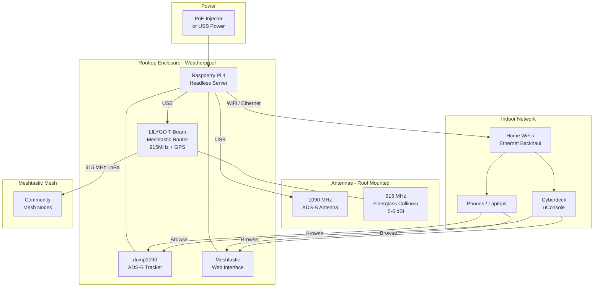

# Rooftop Station Build

Always-on rooftop station mounted near existing ADS-B antennas. Provides Meshtastic mesh relay for the community and ADS-B aircraft tracking. Always-on, mains-powered (or PoE-powered), serves dashboards over the home network.

Complements the portable cyberdeck (see `README.md` for the build guide and `build-rationale.md` for design decisions) — the cyberdeck communicates with this station via Meshtastic when in range and browses the dump1090 / Meshtastic dashboards over the home network when at home.

## Design Goals

- Always-on Pi running headless with dump1090 (ADS-B) and Meshtastic web interface
- T-Beam in ROUTER role, relaying Meshtastic traffic for the community mesh
- Single-cable install via PoE — power and data on one Ethernet run from indoors
- Weatherproof enclosure, lightning-arrested antenna feed
- Low-effort maintenance — set it up once, leave it on the roof

## Architecture

## Components

| Part | Notes | Price |
|------|-------|-------|
| Raspberry Pi 4B (2GB or 4GB) | Runs dump1090 and manages T-Beam via USB. Headless, always on. | $35-55 |
| 128GB microSD | Plenty for OS + dump1090 + Meshtastic. No Kiwix content needed here. | $10-15 |
| LILYGO T-Beam (915 MHz) | Meshtastic router with built-in GPS. Set role to ROUTER for low power + maximum relay. Connected to Pi via USB. | $25-35 |
| 915 MHz fiberglass collinear antenna (5-6 dBi) | Omnidirectional, weatherproof, mounted vertically on roof. Major range improvement over a whip. | $20-30 |
| 1090 MHz ADS-B antenna (already owned or ~$15) | Existing antenna near the station. | $0-15 |
| RTL-SDR dongle for ADS-B | Dedicated SDR for dump1090. Can use a cheap RTL-SDR Blog V3 (~$25) or a second NooElec. | $25-30 |
| Weatherproof enclosure (IP65+) | Junction box or outdoor electrical box. Fits Pi + T-Beam. | $10-15 |
| PoE HAT + PoE injector | Single Ethernet cable carries power + data from inside. Clean install, no separate power supply on the roof. | $15-25 |
| SMA pigtail cables | Short runs from T-Beam and SDR to external antennas | $5-8 |
| Lightning arrestor (915 MHz) | Inline on the Meshtastic antenna feed. Protects T-Beam from lightning strikes. | $10-15 |
| Ethernet cable (outdoor rated) | Run from indoor switch/router to rooftop enclosure | $10-20 |
| Antenna mounting hardware | Brackets, mast clamps, or J-pole mount for the collinear | $10-15 |

### Power Options

| Option | Pros | Cons | Price |
|--------|------|------|-------|
| **PoE (recommended)** | Single cable for power + data, clean install, reliable | Need PoE injector or PoE switch indoors | $15-25 for HAT + injector |
| **USB power run** | Simple, cheap | Long USB runs can have voltage drop, need a thick cable or active extension | $10 |
| **Solar + battery** | Fully independent, works during power outages | More complex, battery maintenance, overkill if you have roof access to power | $40-60 |

PoE is the cleanest option if you can run Ethernet to the roof. One cable does everything.

## Software Stack

- **Raspberry Pi OS Lite (64-bit)** — headless
- **dump1090-mutability** or **dump1090-fa** — ADS-B decoding, serves aircraft map on local network
- **Meshtastic Python CLI / meshtasticd** — manages T-Beam, exposes web interface
- **lighttpd or nginx** — serves dump1090 and Meshtastic dashboards to home network
- **Optional: tar1090** — better ADS-B web UI than stock dump1090
- **Optional: feed to FlightAware / ADS-B Exchange** — contribute your data to the community (requires internet)

## Setup Notes

- Set T-Beam Meshtastic role to **ROUTER** — disables screen, minimizes power, maximizes relay
- Hardcode GPS coordinates in the T-Beam config since it's stationary (saves power vs running GPS continuously)
- Keep coax runs as short as possible — mount the enclosure close to the antennas
- The Pi serves dump1090 and Meshtastic web dashboards over your home network — accessible from the cyberdeck, phones, or any browser
- The T-Beam relays Meshtastic messages for the community mesh — the cyberdeck (and later the AIO V2) communicates through it when in range

---

# Build Phases

### Phase 1 — Software bring-up (indoor bench)
- [ ] Pi 4 + Pi OS Lite installed
- [ ] dump1090 installed and verified with the existing 1090 MHz antenna
- [ ] T-Beam flashed with Meshtastic, role set to ROUTER, GPS coordinates hardcoded
- [ ] Connect T-Beam to Pi via USB; verify `meshtasticd` web interface
- [ ] lighttpd / nginx serving both dashboards on the home network
- [ ] Optional: tar1090 installed for nicer ADS-B UI
- [ ] Optional: FlightAware / ADS-B Exchange feeder configured (internet-only)

### Phase 2 — Hardware install
- [ ] Mount Pi + T-Beam in weatherproof enclosure
- [ ] Run outdoor-rated Ethernet from indoor switch/router to rooftop enclosure
- [ ] Install PoE injector indoors, PoE HAT on the Pi
- [ ] Install 915 MHz collinear antenna with mast clamp / J-pole mount
- [ ] Install lightning arrestor inline on the 915 MHz feed
- [ ] Connect ADS-B antenna and 915 MHz antenna with SMA pigtails
- [ ] Mount enclosure near antennas (keep coax runs short)
- [ ] Power up; verify both dashboards accessible from home network

### Phase 3 — Long-term ops
- [ ] Uptime monitoring (Uptime Kuma, Healthchecks, or similar pinging the Pi)
- [ ] Log rotation configured so the SD card doesn't fill
- [ ] Auto-restart for dump1090 / meshtasticd on crash (systemd `Restart=on-failure`)
- [ ] Periodic health check (CPU temp, free disk, mesh peer count visible on a dashboard)
- [ ] Spare microSD card with cloned image stored indoors for fast field swap

---

# Approximate Total Cost

| Category | Cost |
|----------|------|
| Pi 4 + storage | $45-70 |
| T-Beam + collinear antenna | $45-65 |
| RTL-SDR for ADS-B | $25-30 |
| Enclosure + mounting hardware | $20-30 |
| PoE HAT + injector | $15-25 |
| Cables, lightning arrestor, misc | $25-45 |
| **Rooftop Total** | **$175-265** |
